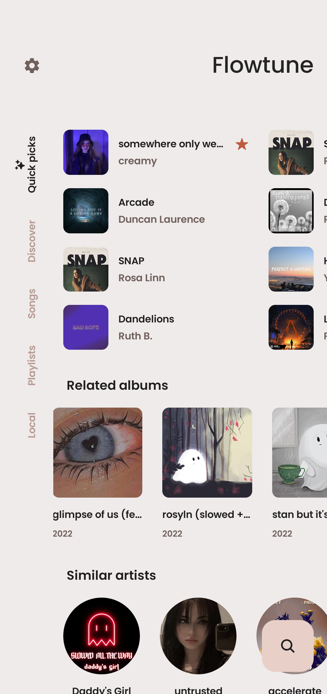
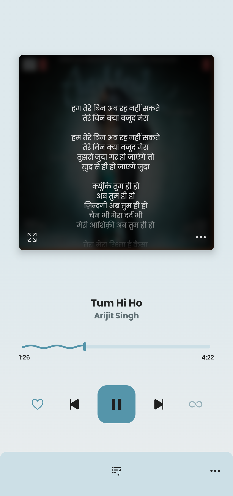

    
    <h1>Flowtune</h1>
    
An Android application for streaming music from YouTube Music

---

  
  
  

  

## Features
- Play (almost) any song or video from YouTube Music
- Background playback
- Cache audio chunks for offline playback
- Search for songs, albums, artists videos and playlists
- Bookmark artists and albums
- Import playlists
- Fetch, display and edit songs lyrics or synchronized lyrics
- Local playlist management
- Reorder songs in playlist or queue
- Light/Dark/Dynamic theme
- Skip silence
- Sleep timer
- Audio normalization
- Android Auto
- Persistent queue
- Open YouTube/YouTube Music links (`watch`, `playlist`, `channel`)
- ...

## Installation

## Note for Developer's 
- Fork the **Dev** Branch to get source
- App must be signed with your **Keystore**
- credit must be given to the respective authors

    
## Acknowledgments
- [**YouTube-Internal-Clients**](https://github.com/zerodytrash/YouTube-Internal-Clients): A python script that discovers hidden YouTube API clients. Just a research project.
- [**ionicons**](https://github.com/ionic-team/ionicons): Premium hand-crafted icons built by Ionic, for Ionic apps and web apps everywhere.

## Disclaimer
This project and its contents are not affiliated with, funded, authorized, endorsed by, or in any way associated with YouTube, Google LLC or any of its affiliates and subsidiaries.

Any trademark, service mark, trade name, or other intellectual property rights used in this project are owned by the respective owners.
